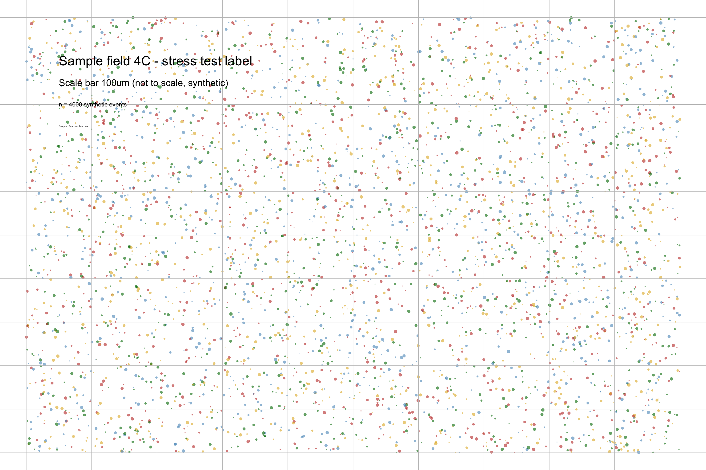
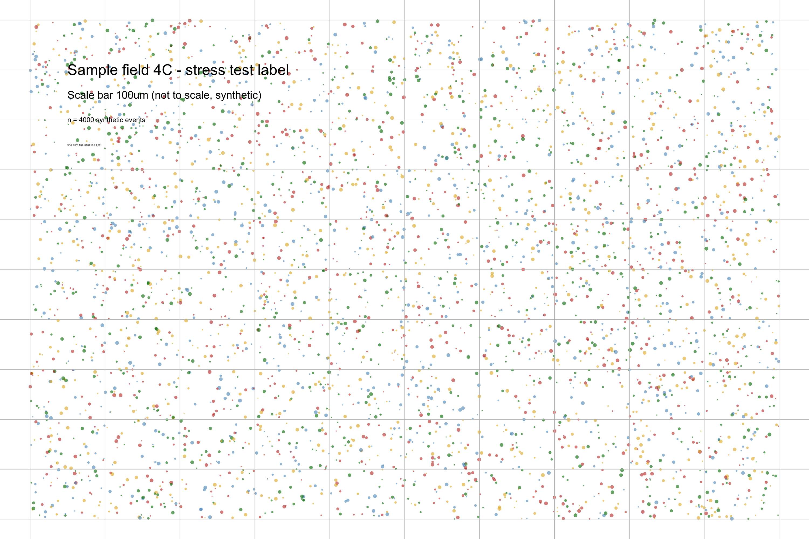
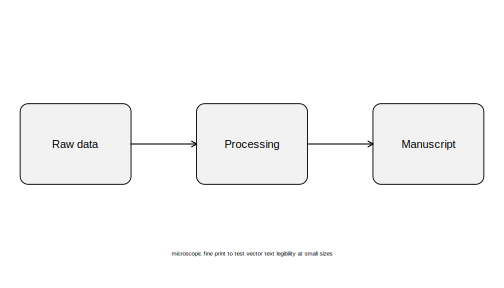

---
# Render this project via `targets::tar_make()` (the `render_site` target in
# _targets.R), not `quarto render` on this file directly — see manuscript.qmd.
#
# This is a minimal reproducible example (MRE) for images and diagrams in
# Quarto: mermaid diagrams, auto-generated (ggplot2) figures, and images
# created elsewhere and loaded from a file, across HTML, docx, and typst
# (PDF) output. Render all three formats and open them next to each other.
#
# To surface this notebook in the site navigation, see the comment in
# supplementary/notebook-template.qmd.
title: "Images & diagrams in Quarto: mermaid, ggplot, and files"
---

```{r}
#| label: setup
#| include: false
library(ggplot2)
library(here)
here::i_am("manuscript/supplementary/images-mre.qmd")

set.seed(1)
```



::: {.callout-tip}
# The Short Version
- Mermaid diagrams work natively across html/docx/typst with zero extra
  install — Quarto converts them to PNG for docx/typst on its own
- PNG and JPEG are the safe defaults — they work everywhere with no warnings
- SVG is native (vector) in html and typst, but needs `rsvg-convert` on
  PATH for docx — without it, pandoc warns and the docx image has no raster
  fallback
- **TIFF hard-errors typst outright** — and because `tar_quarto()` renders
  all formats in one pass, that one error blocks html and docx from being
  updated too, even though they'd have rendered fine on their own
- Fine text/thin lines that look fine at 100% become illegible once a
  figure is scaled down to fit page width — check the actual rendered
  output at its real size, not the source image
- Uncompressed TIFF is enormous (~24MB in testing here) versus PNG/JPEG for
  the same content — compress it if it has to go in the repo
:::

# Why this notebook exists

Figures and diagrams have the same problem tables do
([tables-mre.qmd](tables-mre.qmd)): what works on screen doesn't
automatically work identically across html, docx, and typst. Findings below
are from direct testing in this template — commands were actually run
against `--to html`, `--to docx`, and `--to typst`, and outputs were
inspected (extracted docx media, `pdftotext`, rendered PDF pages), not
assumed from documentation.

# Mermaid diagrams

Quarto renders ```` ```{mermaid} ```` code blocks natively in HTML via
mermaid.js. The interesting question is what happens for docx/typst, since
those aren't JS-capable targets — confirmed here: Quarto converts the
diagram to a static PNG automatically, with **no system Node/Deno/mermaid-cli
install required** (this environment has none of those on `PATH` and the
diagrams still rendered correctly in all three formats).

```{mermaid}
%%| label: fig-mermaid-flowchart
%%| fig-cap: "A simple pipeline flowchart"
flowchart LR
  A[Raw data] --> B[Processing]
  B --> C[Manuscript]
```

```{mermaid}
%%| label: fig-mermaid-sequence
%%| fig-cap: "A sequence diagram"
sequenceDiagram
  participant R as R/targets
  participant Q as Quarto
  participant P as Pandoc
  R->>Q: tar_quarto() renders the project
  Q->>P: hands off each format
  P-->>Q: html / docx / typst
  Q-->>R: rendered site in output/
```

- ✅ Works out of the box in html/docx/typst — no Lua filter, no extension,
  no system dependency needed for this to render *something*.
- The docx/typst versions are a **raster PNG**, not an editable diagram —
  if a collaborator needs to tweak wording in the Word version by hand,
  they're editing a picture, not text. Worth knowing before you rely on
  "just fix it in Word" as a fallback plan.

# Auto-generated figures: ggplot2

Ordinary knitr-managed figures pick up the global `fig-width`/`fig-height`/
`fig-dpi` settings in `_quarto.yml` (currently 6in × 4in × 300dpi, with html
getting knitr's `fig.retina = 2` default on top — see the README/CLAUDE.md
for that finding). That global sizing is a fine default for a single plot,
but breaks down fast for a faceted plot with many panels.

```{r}
#| label: fig-simple
#| fig-cap: "A single plot at the default global fig dimensions"
d <- data.frame(x = rnorm(100), y = rnorm(100))
ggplot(d, aes(x, y)) +
  geom_point() +
  theme_bw()
```

## Facets at the default size

```{r}
#| label: fig-facet-default
#| fig-cap: "9 facets, default 6x4 global fig dimensions — legibility suffers"
d2 <- data.frame(
  x = rnorm(900),
  y = rnorm(900),
  g1 = sample(letters[1:3], 900, replace = TRUE),
  g2 = sample(LETTERS[1:3], 900, replace = TRUE)
)
p <- ggplot(d2, aes(x, y)) +
  geom_point(size = 0.5, alpha = 0.4) +
  facet_grid(g1 ~ g2) +
  theme_bw(base_size = 11)
p
```

## The same facets, sized for the content instead of the default

Per-chunk `fig-width`/`fig-height` override the document-wide default, and
a smaller `base_size` keeps facet-strip and axis text from dominating the
panel:

```{r}
#| label: fig-facet-fixed
#| fig-cap: "Same 9 facets, wider/taller + smaller base font"
#| fig-width: 8
#| fig-height: 6
p + theme_bw(base_size = 9)
```

**Takeaway:** don't leave a multi-facet plot at whatever the document-wide
default is "because that's what everything else uses" — check it renders
legibly and override `fig-width`/`fig-height` (and font size) per chunk
when it doesn't.

# Images created elsewhere, loaded from a file

Not every figure comes from an R chunk — diagrams from Illustrator/
Inkscape/PowerPoint, scans, micrographs, and photos all arrive as files to
embed rather than code to run. Format support for *that* path turns out to
vary a lot more than for knitr-generated figures, because pandoc/typst have
to handle whatever format the file happens to be in.

The four fixture images below (`img/`, generated by
[`generate-images.R`](../generate-images.R)) share the same busy synthetic
content — dense scatter, thin grid lines, and shrinking text labels — so
format differences aren't hidden by a simple test image.

Note these are plain markdown `` image references, not
`knitr::include_graphics()` calls — Quarto/pandoc always resolve markdown
image paths relative to the `.qmd` file's own location, independent of
`execute-dir`/`here()` (which only affect where *R code* executes and
constructs paths). Mixing the two — passing an absolute `here()` path to
`include_graphics()` under `execute-dir: project` — produced a
double-relative path and a "file not found" error when tested; plain
relative markdown paths are the right tool for a static file reference
like this one.

## PNG and JPEG — the safe defaults

{#fig-png width="50%"}

{#fig-jpg width="50%"}

- ✅ Both render cleanly in html/docx/typst with no warnings.
- At this content and quality setting the JPEG compression artifacts
  weren't visually obvious next to the PNG — don't assume that holds at
  lower quality settings or with sharper line art.

## SVG — native vector in html/typst, needs a system dependency for docx

{#fig-svg width="50%"}

- ✅ **html**: renders natively — it's just an `` pointing at an SVG,
  the browser does the work.
- ✅ **typst**: renders natively as real vector output — confirmed by
  extracting text from the compiled PDF with `pdftotext`; the diagram's
  fine-print label came back as actual text, not a rasterized blob.
- ⚠️ **docx**: pandoc emits `Could not convert image img/sample-diagram.svg:
  "check that rsvg-convert is in path."` and embeds the raw SVG with no
  raster fallback — normally pandoc generates a PNG/EMF fallback alongside
  the SVG for Word compatibility, and that step is what's missing here.
  This environment doesn't have `rsvg-convert` on `PATH` (a separate
  system binary from R's `svglite`/`magick` packages — installing
  `librsvg`/`rsvg-convert` is what fixes it). Not visually confirmed in
  Word itself in this session (no Word/LibreOffice available here) — but
  a docx image with no fallback raster is a well-known way to get a
  blank/broken image box in Word, so treat this as **unverified-risky**,
  not verified-fine. Safest bet: convert vector diagrams meant for docx to
  PNG ahead of time, or install `rsvg-convert` and re-check in actual Word.

## TIFF — hard-errors typst, and takes html/docx down with it

::: {.content-visible unless-format="typst"}
{#fig-tiff width="50%"}
:::

::: {.content-visible when-format="typst"}
*TIFF figure omitted here for typst — see the callout below for why.*
:::

::: {.callout-warning}
## Found while testing: one unsupported image format breaks every format's output, not just its own

`` compiles to a **hard typst error**:
`error: unknown image format` — typst's image decoder doesn't support TIFF
at all, confirmed directly (not inferred from docs).

The consequential part: because `tar_quarto()` / `quarto render --to all`
renders every configured format from one invocation, a hard failure in
*any one* of them stops the whole command before it copies output — html
and docx never get updated either, even though both had already rendered
successfully with no error or warning for the same TIFF. Confirmed by
timestamp: after the typst failure, `output/*.html` and `output/*.docx`
were untouched from the previous run, despite `quarto render` printing no
error for those two stages. A clean re-render with the TIFF removed
produced fresh html/docx/typst output immediately.

Practically: **one bad TIFF (or any other typst-unsupported format)
silently stalls your entire manuscript build**, not just the PDF. If
`tar_make()` seems to be serving stale html/docx, check for a typst error
buried earlier in the log before assuming the pipeline didn't run at all.

Separately — even where TIFF doesn't hard-error (html, docx), it's a poor
choice for anything meant to be *seen*: browsers have never supported
inline TIFF rendering, and Word's TIFF support is inconsistent across
versions/platforms (not independently verified in Word this session).
docx did accept it silently (no warning, raw TIFF embedded) but "pandoc
didn't complain" isn't the same claim as "Word will display it" — the
`rsvg-convert` caveat above applies here too: only the parts we could
directly check (build success/failure, extracted media) are stated as
confirmed.

**If you have TIFF source images**: convert to PNG before embedding.
Nothing about TIFF (bit depth, compression) survives being converted at
that point that html/docx/typst can actually use anyway.
:::

## Legibility at real size

The fine-print labels baked into the fixture images (`img/*` — 4 lines,
decreasing size) are the actual point of that "busy" content: at 100% they
read fine, but embedded at half page width (as above) the two smallest
labels are already unreadable in the typst PDF, confirmed by inspecting
the rendered page directly. A figure that looks legible in the source file
or at full screen width is not evidence it'll still be legible once it's
shrunk to fit a page column — check the rendered output at the size it'll
actually appear.

## A note on file size

The same synthetic content, uncompressed, came to **~24MB as TIFF** versus
~850KB as PNG and ~350KB as JPEG — regenerating `img/sample-scan.tiff`
with LZW compression (see `generate-images.R`) brought it down to ~1MB.
Scientific-instrument TIFFs in particular are very often uncompressed by
default; if one is headed into a git-tracked `img/` folder, compress it
first or the repository bloats fast.

# References
