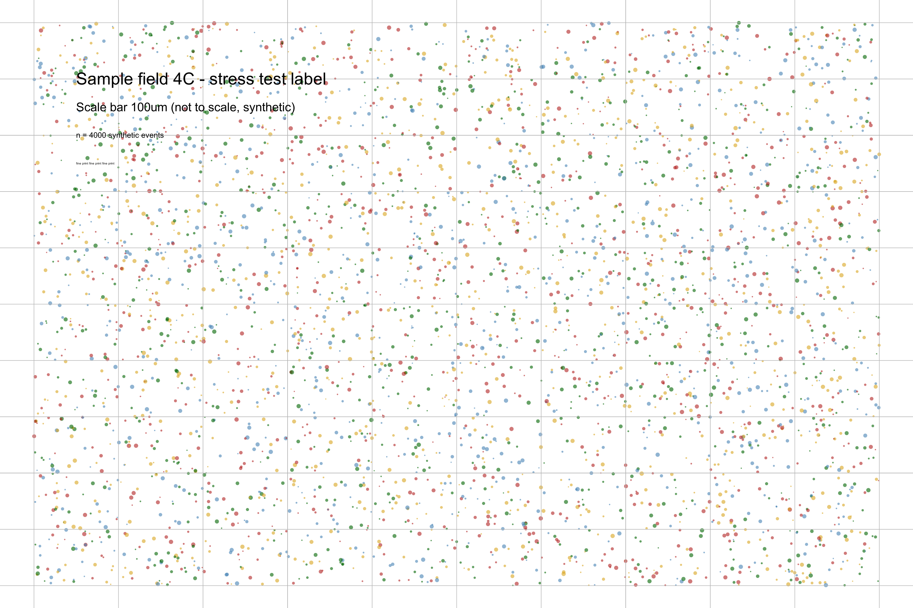
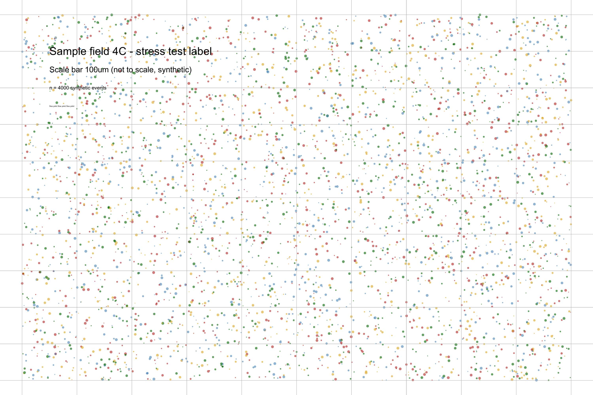
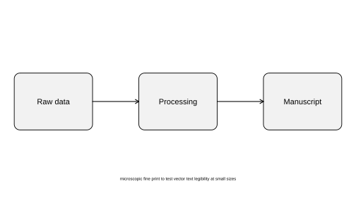

---
# Render via tar_make(), not quarto render directly - see CLAUDE.md.
title: "Image formats: PNG, JPEG, SVG, PDF, TIFF"
---

```{r}
#| label: setup
#| include: false
library(ggplot2)
library(here)
here::i_am("manuscript/supplementary/images-mre.qmd")

set.seed(1)
```



::: {.callout-tip}
# The Short Version
- PNG/JPEG are the only formats that work everywhere with zero warnings.
- SVG is native/vector in html and typst, but docx needs `rsvg-convert`
  on PATH or the image falls back to nothing; use `svglite` (real
  `<text>`), not base R's `svg()` (glyph-outline refs with documented
  Firefox fragility).
- A referenced PDF figure fails quietly in html (blank box) and docx (raw
  bytes Word can't decode) — only typst embeds it correctly. Treat PDF as
  submission-only output, not something to embed directly.
- TIFF hard-errors typst outright, and since `tar_quarto()` renders all
  formats in one pass, that blocks html/docx from updating too — a
  stale-looking render can mean a typst error, not "didn't run."
- Check figures at their actual rendered size, not authoring size —
  fine text/thin lines can become illegible once scaled to page width;
  compress TIFF before committing (uncompressed ~24MB vs ~350-850KB for
  PNG/JPEG).
:::

# Why this notebook exists

Images have the same problem tables do ([tables-mre.qmd](tables-mre.qmd)):
what works on screen doesn't automatically work identically across html,
docx, and typst. Findings below are from direct testing in this template
— commands were run against `--to html`, `--to docx`, and `--to typst`,
and outputs inspected (extracted docx media, `pdftotext`, rendered PDF
pages), not assumed from documentation.

This notebook covers image *file formats* specifically — a diagram/photo/
scan created elsewhere and loaded from a file, not generated inline by an
R chunk. For diagram-drawing tools (Mermaid, Graphviz, cetz, ggraph), see
[diagrams-mre.qmd](diagrams-mre.qmd); for ggplot2 figure sizing/theming,
see [plots-mre.qmd](plots-mre.qmd) — this notebook used to cover all
three before it grew past "file formats."

Not every figure comes from an R chunk — diagrams from Illustrator/
Inkscape/PowerPoint, scans, micrographs, and photos all arrive as files to
embed rather than code to run. Format support for that path varies far
more than for knitr-generated figures, since pandoc/typst have to handle
whatever format the file is actually in.

The four fixture images below (`figures/`, generated by
[`generate-images.R`](../generate-images.R)) share the same busy synthetic
content — dense scatter, thin grid lines, shrinking text labels — so
format differences aren't hidden by a simple test image.

These are plain markdown `` image references, not
`knitr::include_graphics()` calls — Quarto/pandoc always resolve markdown
image paths relative to the `.qmd` file's own location, independent of
`execute-dir`/`here()` (which only affect where *R code* executes and
constructs paths). Mixing the two — passing an absolute `here()` path to
`include_graphics()` under `execute-dir: project` — produced a
double-relative path and a "file not found" error when tested; plain
relative markdown paths are the right tool for a static file reference
like this one.

# PNG and JPEG — the safe defaults

{#fig-png width="50%"}

{#fig-jpg width="50%"}

- ✅ Both render cleanly in html/docx/typst with no warnings.
- At this content and quality setting the JPEG compression artifacts
  weren't visually obvious next to the PNG — don't assume that holds at
  lower quality or with sharper line art.

# SVG — native vector in html/typst, needs a system dependency for docx

{#fig-svg width="50%"}

- ✅ **html**: renders natively — just an `` pointing at an SVG, the
  browser does the work.
- ✅ **typst**: renders natively as real vector output — confirmed by
  extracting text from the compiled PDF with `pdftotext`; the diagram's
  fine-print label came back as actual text, not a rasterized blob.
- ⚠️ **docx**: pandoc emits `Could not convert image figures/sample-diagram.svg:
  "check that rsvg-convert is in path."` and embeds the raw SVG with no
  raster fallback — pandoc normally generates a PNG/EMF fallback alongside
  the SVG for Word compatibility, and that step is what's missing here.
  This environment has no `rsvg-convert` on `PATH` (a separate system
  binary from R's `svglite`/`magick` packages — installing
  `librsvg`/`rsvg-convert` fixes it). Not visually confirmed in Word
  itself (no Word/LibreOffice available here) — but a docx image with no
  fallback raster is a well-known way to get a blank/broken image box in
  Word, so treat this as **unverified-risky**, not verified-fine. Safest
  bet: convert vector diagrams meant for docx to PNG ahead of time, or
  install `rsvg-convert` and re-check in actual Word.

## Which R device writes the SVG matters — not just "SVG vs other formats"

The fixture above is deliberately drawn with `svglite::svglite()`
(`generate-images.R`), not base R's own `svg()` device — worth checking
whether that choice actually matters, rather than treating "SVG" as one
interchangeable thing.

It does. The same content via base R's `svg()` (Cairo-backed on this
machine, confirmed via `capabilities("cairo")`) produces structurally
different markup: `svglite` writes real `<text>` elements referencing a
font **by name** (`style='font-family: "Arial";'`), while `svg()`
converts every character to a vector outline path, defines each unique
glyph once in `<defs>`, and places each character with `<use
xlink:href="#glyph-0-N">` — confirmed by generating both from identical
`grid` content and diffing the output directly, not assumed from either
package's docs.

Both parse as well-formed XML and both rendered correctly here (checked
directly: loaded each as a standalone top-level SVG document — no
`document.body`, `document.documentElement.tagName` is `"svg"`, exactly
how a browser handles a `.svg` opened directly rather than embedded —
and confirmed real text/glyph content present, not a parse failure).
**But `<use xlink:href="#glyph-N">` self-referencing glyph output is a
specifically documented area of Firefox fragility that svglite's plain
`<text>` approach never exercises at all** — Mozilla bugzilla has
several open/historical reports of exactly this pattern
([1778298](https://bugzilla.mozilla.org/show_bug.cgi?id=1778298),
[316959](https://bugzilla.mozilla.org/show_bug.cgi?id=316959)),
including one specifically about a Content-Security-Policy interaction
([1303364](https://bugzilla.mozilla.org/show_bug.cgi?id=1303364)) — the
kind of thing that could plausibly read as "a security issue" in
hindsight. **Not independently reproduced in actual Firefox here** (this
environment's browser-testing tool is Chromium/Electron-based, the same
engine family Positron's own plot viewer runs on — which would neatly
explain "works in Positron, not in Firefox" as a Chromium-vs-Gecko
difference rather than anything wrong with the file itself) — flagged as
well-sourced, not confirmed first-hand, same epistemic bar as the
`rsvg-convert` caveat above.

**Practical upshot**: this project already uses `svglite` exclusively
(`generate-images.R`, every ggplot figure via the `ragg_png` knitr
device for raster output) — the safer choice was already made, this
just documents *why* it matters, rather than being a fix that's needed.
If a future contributor reaches for a different SVG-producing
device/package, check whether it emits real `<text>` (portable) or
glyph-outline `<use>` references (Chromium-safe, Firefox-risky) before
assuming "it's SVG, it'll be fine everywhere."

**On SVG metadata**, the other half of the question: `svglite`'s output
here carries no more than what's needed to draw the shapes — an XML
declaration, the `svg`/`xlink` namespace declarations SVG requires, one
`<style>` block (CSS rules for stroke/fill defaults, scoped to a
`.svglite` class so it can't leak into a host page if inlined), a
`<clipPath>` sized to the canvas, and the drawn shapes/text themselves.
**No embedded font files, no external resource references, no
scripts** — a font is referenced purely by *name* (confirmed in
[fonts-mre.qmd](fonts-mre.qmd)'s own finding that `svglite` doesn't
embed the font it registers, only its name), so nothing here reaches
outside the file at render time. Worth knowing precisely what's *not*
there, not just what is, when a "security issue" is the working theory
for a rendering bug.

# PDF — the opposite failure shape from TIFF: nothing errors, two formats silently misbehave

A `ggsave(..., device = "pdf")`/`cairo_pdf()` figure is a real, common
case journals ask for directly (vector, more universally accepted than
SVG) — worth checking whether a plain `` reference to one behaves
the way SVG does, rather than assuming.

{#fig-pdf width="50%"}

::: {.callout-warning}
## Found while testing: PDF's failure mode is the inverse of TIFF's — quiet, not loud

`` produces **no error and no warning in
any format** — which sounds better than TIFF's hard typst error, but is
actually worse in practice, because two of the three formats silently
do the wrong thing instead of failing loudly:

- 🛑 **html**: renders as a **blank box** — confirmed by actually loading
  the compiled page in a browser and screenshotting it, not just reading
  the markup. This project's site-wide `lightbox: true` (`_quarto.yml`)
  turns out to matter here: a bare Quarto project with lightbox off
  simply never writes an `` tag for this reference at all (checked
  first, in an isolated test project); with lightbox on, as this project
  actually has it, Quarto instead emits `<embed src="....pdf">` — a real
  tag, no missing markup — but that embed still renders solid blank,
  confirmed identically whether the page is opened via `file://` or a
  real local http server (ruling out a "static preview" artifact).
  **Two different-looking failures depending on a site setting that has
  nothing to do with images** — check the actual project's config before
  trusting a minimal reproduction of a rendering question like this one.
- ⚠️ **docx**: pandoc embeds the raw PDF bytes into a picture element
  (`<pic:blipFill><a:blip r:embed="..." />`, confirmed by inspecting the
  docx's raw XML) pointing at a relationship of `Type=".../image"` whose
  target is literally the `.pdf` file. PDF is not a valid raster format
  for that XML element (png/jpeg/gif/bmp/tiff/wmf/emf are); Word almost
  certainly can't decode it. **Not visually confirmed in Word** (same
  caveat as the SVG section above, no Word available in this
  environment) — treat as **unverified-risky, leaning broken**, not
  unverified-fine.
- ✅ **typst**: genuinely correct, and the best result of the three —
  confirmed by `pdftotext`-extracting the compiled PDF: the diagram's
  fine-print label came back as real text, meaning typst embedded the
  referenced PDF as an actual vector page, not a raster fallback. No
  warning printed, unlike the SVG case above.

**Practically the reverse lesson from TIFF's section below**: TIFF fails
loudly in one format and (via `tar_quarto()`'s single invocation)
silently stalls the *other two* into staleness — a failure you're
guaranteed to notice, even if the reason takes digging. A plain PDF
reference fails quietly in two formats that both report success — the
kind of failure that ships unnoticed unless someone actually opens the
html and docx output, not just checks that `tar_make()` exited cleanly.
:::

**Practical takeaway — don't embed a PDF figure directly, same
conclusion the TIFF section reaches for different reasons**: keep SVG
(or a PNG fallback) as what actually gets referenced in the manuscript
for html/docx, and treat a real vector PDF as a *submission-only*
artifact — generated alongside the embedded figure (e.g. `ggsave(...,
device = cairo_pdf)` next to the PNG/SVG version), written to
`submission/` via the same pattern `export_figure_tiff()` already
uses for TIFF (see "Standalone submission exports" in CLAUDE.md), not
referenced from `manuscript.qmd` itself. Typst is the one format where
embedding it directly would actually work cleanly — not worth relying on
alone, since it fails differently (not loudly) in the other two.

# TIFF — hard-errors typst, and takes html/docx down with it

::: {.content-visible unless-format="typst"}
{#fig-tiff width="50%"}
:::

::: {.content-visible when-format="typst"}
*TIFF figure omitted here for typst — see the callout below for why.*
:::

::: {.callout-warning}
## Found while testing: one unsupported image format breaks every format's output, not just its own

`` compiles to a **hard typst error**:
`error: unknown image format` — typst's image decoder doesn't support
TIFF at all, confirmed directly (not inferred from docs).

The consequential part: `tar_quarto()` / `quarto render --to all` renders
every configured format from one invocation, so a hard failure in *any
one* stops the whole command before it copies output — html and docx
never get updated either, even though both had already rendered
successfully for the same TIFF. Confirmed by timestamp: after the typst
failure, `output/*.html` and `output/*.docx` were untouched from the
previous run, despite `quarto render` printing no error for those two
stages. A clean re-render with the TIFF removed produced fresh
html/docx/typst output immediately.

Practically: **one bad TIFF (or any other typst-unsupported format)
silently stalls the entire manuscript build**, not just the PDF. If
`tar_make()` seems to be serving stale html/docx, check for a typst error
earlier in the log before assuming the pipeline didn't run.

Separately — even where TIFF doesn't hard-error (html, docx), it's a poor
choice for anything meant to be *seen*: browsers have never supported
inline TIFF rendering, and Word's TIFF support is inconsistent across
versions/platforms (not independently verified in Word this session).
docx accepted it silently (no warning, raw TIFF embedded), but "pandoc
didn't complain" isn't the same claim as "Word will display it" — the
`rsvg-convert` caveat above applies here too: only build success/failure
and extracted media were directly checked and can be stated as confirmed.

**If you have TIFF source images**: convert to PNG before embedding.
Nothing about TIFF (bit depth, compression) survives being converted at
that point that html/docx/typst can actually use anyway.
:::

# Legibility at real size

The fine-print labels baked into the fixture images (`figures/*` — 4 lines,
decreasing size) are the point of that "busy" content: at 100% they read
fine, but embedded at half page width (as above) the two smallest labels
are already unreadable in the typst PDF, confirmed by inspecting the
rendered page directly. A figure legible in the source file or at full
screen width isn't evidence it'll stay legible shrunk to a page column —
check the rendered output at the size it'll actually appear.

# A note on file size

The same synthetic content, uncompressed, came to **~24MB as TIFF** versus
~850KB as PNG and ~350KB as JPEG — regenerating `figures/sample-scan.tiff`
with LZW compression (see `generate-images.R`) brought it down to ~1MB.
Scientific-instrument TIFFs are often uncompressed by default; compress
one before it goes into a git-tracked `figures/` folder or the repo bloats fast.

# References
